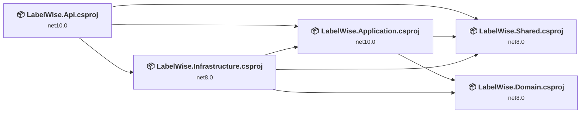
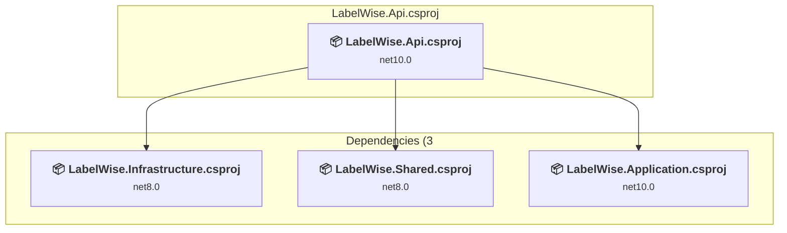
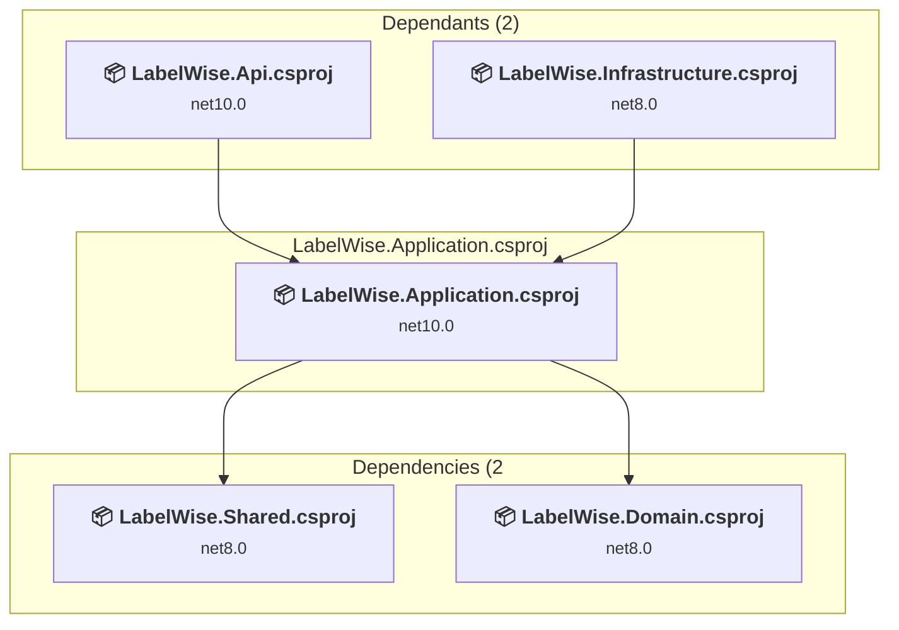
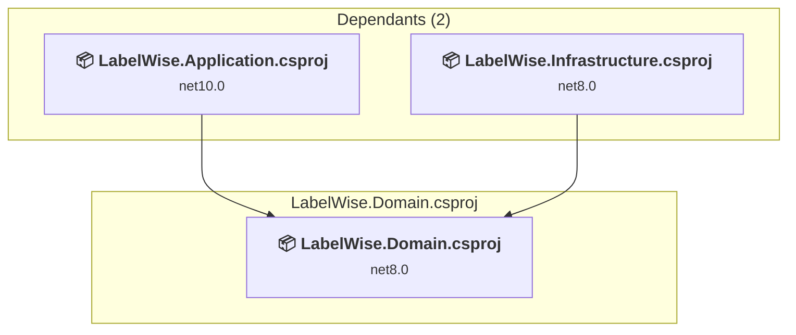
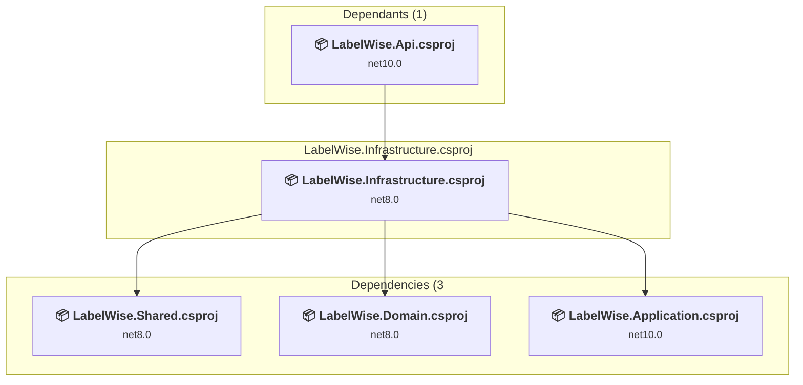
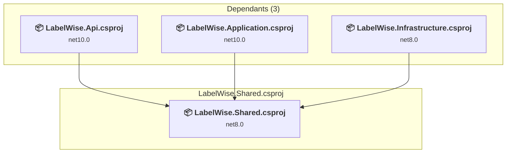

# Projects and dependencies analysis

This document provides a comprehensive overview of the projects and their dependencies in the context of upgrading to .NETCoreApp,Version=v10.0.

## Table of Contents

- [Executive Summary](#executive-Summary)
  - [Highlevel Metrics](#highlevel-metrics)
  - [Projects Compatibility](#projects-compatibility)
  - [Package Compatibility](#package-compatibility)
  - [API Compatibility](#api-compatibility)
- [Aggregate NuGet packages details](#aggregate-nuget-packages-details)
- [Top API Migration Challenges](#top-api-migration-challenges)
  - [Technologies and Features](#technologies-and-features)
  - [Most Frequent API Issues](#most-frequent-api-issues)
- [Projects Relationship Graph](#projects-relationship-graph)
- [Project Details](#project-details)

  - [LabelWise.Api\LabelWise.Api.csproj](#labelwiseapilabelwiseapicsproj)
  - [LabelWise.Application\LabelWise.Application.csproj](#labelwiseapplicationlabelwiseapplicationcsproj)
  - [LabelWise.Domain\LabelWise.Domain.csproj](#labelwisedomainlabelwisedomaincsproj)
  - [LabelWise.Infrastructure\LabelWise.Infrastructure.csproj](#labelwiseinfrastructurelabelwiseinfrastructurecsproj)
  - [LabelWise.Shared\LabelWise.Shared.csproj](#labelwisesharedlabelwisesharedcsproj)

## Executive Summary

### Highlevel Metrics

| Metric | Count | Status |
| :--- | :---: | :--- |
| Total Projects | 5 | 3 require upgrade |
| Total NuGet Packages | 10 | 2 need upgrade |
| Total Code Files | 68 |  |
| Total Code Files with Incidents | 3 |  |
| Total Lines of Code | 2539 |  |
| Total Number of Issues | 5 |  |
| Estimated LOC to modify | 0+ | at least 0,0% of codebase |

### Projects Compatibility

| Project | Target Framework | Difficulty | Package Issues | API Issues | Est. LOC Impact | Description |
| :--- | :---: | :---: | :---: | :---: | :---: | :--- |
| [LabelWise.Api\LabelWise.Api.csproj](#labelwiseapilabelwiseapicsproj) | net10.0 | ✅ None | 0 | 0 |  | AspNetCore, Sdk Style = True |
| [LabelWise.Application\LabelWise.Application.csproj](#labelwiseapplicationlabelwiseapplicationcsproj) | net10.0 | ✅ None | 0 | 0 |  | ClassLibrary, Sdk Style = True |
| [LabelWise.Domain\LabelWise.Domain.csproj](#labelwisedomainlabelwisedomaincsproj) | net8.0 | 🟢 Low | 0 | 0 |  | ClassLibrary, Sdk Style = True |
| [LabelWise.Infrastructure\LabelWise.Infrastructure.csproj](#labelwiseinfrastructurelabelwiseinfrastructurecsproj) | net8.0 | 🟢 Low | 1 | 0 |  | ClassLibrary, Sdk Style = True |
| [LabelWise.Shared\LabelWise.Shared.csproj](#labelwisesharedlabelwisesharedcsproj) | net8.0 | 🟢 Low | 1 | 0 |  | ClassLibrary, Sdk Style = True |

### Package Compatibility

| Status | Count | Percentage |
| :--- | :---: | :---: |
| ✅ Compatible | 8 | 80,0% |
| ⚠️ Incompatible | 0 | 0,0% |
| 🔄 Upgrade Recommended | 2 | 20,0% |
| ***Total NuGet Packages*** | ***10*** | ***100%*** |

### API Compatibility

| Category | Count | Impact |
| :--- | :---: | :--- |
| 🔴 Binary Incompatible | 0 | High - Require code changes |
| 🟡 Source Incompatible | 0 | Medium - Needs re-compilation and potential conflicting API error fixing |
| 🔵 Behavioral change | 0 | Low - Behavioral changes that may require testing at runtime |
| ✅ Compatible | 1555 |  |
| ***Total APIs Analyzed*** | ***1555*** |  |

## Aggregate NuGet packages details

| Package | Current Version | Suggested Version | Projects | Description |
| :--- | :---: | :---: | :--- | :--- |
| Microsoft.AspNetCore.Authentication.JwtBearer | 8.0.0 |  | [LabelWise.Api.csproj](#labelwiseapilabelwiseapicsproj) | ✅Compatible |
| Microsoft.AspNetCore.Cryptography.KeyDerivation | 8.0.0 |  | [LabelWise.Application.csproj](#labelwiseapplicationlabelwiseapplicationcsproj) | ✅Compatible |
| Microsoft.EntityFrameworkCore | 8.0.0 |  | [LabelWise.Application.csproj](#labelwiseapplicationlabelwiseapplicationcsproj) | ✅Compatible |
| Microsoft.EntityFrameworkCore.Design | 8.0.0 | 10.0.5 | [LabelWise.Infrastructure.csproj](#labelwiseinfrastructurelabelwiseinfrastructurecsproj) | Recomenda-se a atualização do pacote NuGet |
| Microsoft.Extensions.Configuration.Binder | 8.0.0 | 10.0.5 | [LabelWise.Shared.csproj](#labelwisesharedlabelwisesharedcsproj) | Recomenda-se a atualização do pacote NuGet |
| Microsoft.Extensions.DependencyInjection.Abstractions | 8.0.0 |  | [LabelWise.Application.csproj](#labelwiseapplicationlabelwiseapplicationcsproj) | ✅Compatible |
| Microsoft.Extensions.Options | 8.0.0 |  | [LabelWise.Application.csproj](#labelwiseapplicationlabelwiseapplicationcsproj) | ✅Compatible |
| Npgsql.EntityFrameworkCore.PostgreSQL | 8.0.0 |  | [LabelWise.Infrastructure.csproj](#labelwiseinfrastructurelabelwiseinfrastructurecsproj) | ✅Compatible |
| Swashbuckle.AspNetCore | 6.5.0 |  | [LabelWise.Api.csproj](#labelwiseapilabelwiseapicsproj) | ✅Compatible |
| System.IdentityModel.Tokens.Jwt | 6.30.0 |  | [LabelWise.Application.csproj](#labelwiseapplicationlabelwiseapplicationcsproj) | ✅Compatible |

## Top API Migration Challenges

### Technologies and Features

| Technology | Issues | Percentage | Migration Path |
| :--- | :---: | :---: | :--- |

### Most Frequent API Issues

| API | Count | Percentage | Category |
| :--- | :---: | :---: | :--- |

## Projects Relationship Graph

Legend:
📦 SDK-style project
⚙️ Classic project

## Project Details

### LabelWise.Api\LabelWise.Api.csproj

#### Project Info

- **Current Target Framework:** net10.0✅
- **SDK-style**: True
- **Project Kind:** AspNetCore
- **Dependencies**: 3
- **Dependants**: 0
- **Number of Files**: 6
- **Lines of Code**: 320
- **Estimated LOC to modify**: 0+ (at least 0,0% of the project)

#### Dependency Graph

Legend:
📦 SDK-style project
⚙️ Classic project

### API Compatibility

| Category | Count | Impact |
| :--- | :---: | :--- |
| 🔴 Binary Incompatible | 0 | High - Require code changes |
| 🟡 Source Incompatible | 0 | Medium - Needs re-compilation and potential conflicting API error fixing |
| 🔵 Behavioral change | 0 | Low - Behavioral changes that may require testing at runtime |
| ✅ Compatible | 0 |  |
| ***Total APIs Analyzed*** | ***0*** |  |

### LabelWise.Application\LabelWise.Application.csproj

#### Project Info

- **Current Target Framework:** net10.0✅
- **SDK-style**: True
- **Project Kind:** ClassLibrary
- **Dependencies**: 2
- **Dependants**: 2
- **Number of Files**: 30
- **Lines of Code**: 960
- **Estimated LOC to modify**: 0+ (at least 0,0% of the project)

#### Dependency Graph

Legend:
📦 SDK-style project
⚙️ Classic project

### API Compatibility

| Category | Count | Impact |
| :--- | :---: | :--- |
| 🔴 Binary Incompatible | 0 | High - Require code changes |
| 🟡 Source Incompatible | 0 | Medium - Needs re-compilation and potential conflicting API error fixing |
| 🔵 Behavioral change | 0 | Low - Behavioral changes that may require testing at runtime |
| ✅ Compatible | 0 |  |
| ***Total APIs Analyzed*** | ***0*** |  |

### LabelWise.Domain\LabelWise.Domain.csproj

#### Project Info

- **Current Target Framework:** net8.0
- **Proposed Target Framework:** net10.0
- **SDK-style**: True
- **Project Kind:** ClassLibrary
- **Dependencies**: 0
- **Dependants**: 2
- **Number of Files**: 15
- **Number of Files with Incidents**: 1
- **Lines of Code**: 592
- **Estimated LOC to modify**: 0+ (at least 0,0% of the project)

#### Dependency Graph

Legend:
📦 SDK-style project
⚙️ Classic project

### API Compatibility

| Category | Count | Impact |
| :--- | :---: | :--- |
| 🔴 Binary Incompatible | 0 | High - Require code changes |
| 🟡 Source Incompatible | 0 | Medium - Needs re-compilation and potential conflicting API error fixing |
| 🔵 Behavioral change | 0 | Low - Behavioral changes that may require testing at runtime |
| ✅ Compatible | 728 |  |
| ***Total APIs Analyzed*** | ***728*** |  |

### LabelWise.Infrastructure\LabelWise.Infrastructure.csproj

#### Project Info

- **Current Target Framework:** net8.0
- **Proposed Target Framework:** net10.0
- **SDK-style**: True
- **Project Kind:** ClassLibrary
- **Dependencies**: 3
- **Dependants**: 1
- **Number of Files**: 17
- **Number of Files with Incidents**: 1
- **Lines of Code**: 657
- **Estimated LOC to modify**: 0+ (at least 0,0% of the project)

#### Dependency Graph

Legend:
📦 SDK-style project
⚙️ Classic project

### API Compatibility

| Category | Count | Impact |
| :--- | :---: | :--- |
| 🔴 Binary Incompatible | 0 | High - Require code changes |
| 🟡 Source Incompatible | 0 | Medium - Needs re-compilation and potential conflicting API error fixing |
| 🔵 Behavioral change | 0 | Low - Behavioral changes that may require testing at runtime |
| ✅ Compatible | 811 |  |
| ***Total APIs Analyzed*** | ***811*** |  |

### LabelWise.Shared\LabelWise.Shared.csproj

#### Project Info

- **Current Target Framework:** net8.0
- **Proposed Target Framework:** net10.0
- **SDK-style**: True
- **Project Kind:** ClassLibrary
- **Dependencies**: 0
- **Dependants**: 3
- **Number of Files**: 1
- **Number of Files with Incidents**: 1
- **Lines of Code**: 10
- **Estimated LOC to modify**: 0+ (at least 0,0% of the project)

#### Dependency Graph

Legend:
📦 SDK-style project
⚙️ Classic project

### API Compatibility

| Category | Count | Impact |
| :--- | :---: | :--- |
| 🔴 Binary Incompatible | 0 | High - Require code changes |
| 🟡 Source Incompatible | 0 | Medium - Needs re-compilation and potential conflicting API error fixing |
| 🔵 Behavioral change | 0 | Low - Behavioral changes that may require testing at runtime |
| ✅ Compatible | 16 |  |
| ***Total APIs Analyzed*** | ***16*** |  |

