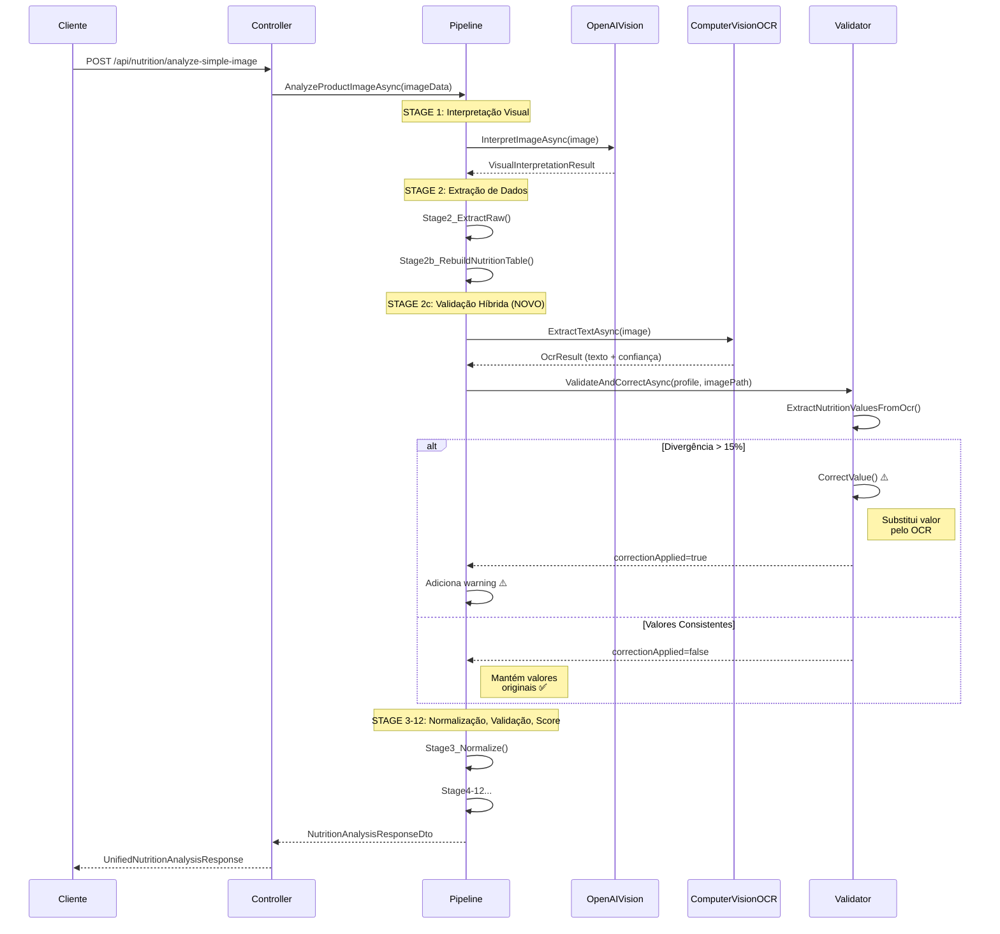

# Fluxo Detalhado - Validação Híbrida OCR

## 📊 Diagrama de Sequência



## 🔄 Fluxo de Decisão

```
┌─────────────────────────────────────────┐
│     Imagem da Tabela Nutricional        │
└─────────────┬───────────────────────────┘
              │
              ▼
┌─────────────────────────────────────────┐
│  STAGE 1: Azure OpenAI Vision (GPT-4)   │
│  • Extração contextual                  │
│  • Compreensão semântica                │
│  • Valores iniciais                     │
└─────────────┬───────────────────────────┘
              │
              ▼
┌─────────────────────────────────────────┐
│  STAGE 2: Extração de Dados Brutos      │
│  • Parse da resposta da IA              │
│  • Rebuild da tabela nutricional        │
└─────────────┬───────────────────────────┘
              │
              ▼
┌─────────────────────────────────────────┐
│  STAGE 2c: Validação Híbrida OCR (NOVO) │
└─────────────┬───────────────────────────┘
              │
              ▼
┌─────────────────────────────────────────┐
│  Computer Vision OCR executa extração   │
│  paralela de texto                      │
└─────────────┬───────────────────────────┘
              │
              ▼
      ┌───────────────┐
      │  COMPARADOR   │
      │               │
      │  Para cada    │
      │  nutriente:   │
      │  • Calorias   │
      │  • Proteínas  │
      │  • Gorduras   │
      │  • Carboidratos│
      │  • Sódio      │
      └───────┬───────┘
              │
              ▼
    ┌─────────────────────┐
    │  Calcula Divergência │
    │  |AI - OCR| / AI     │
    └─────────┬────────────┘
              │
              ▼
        ┌─────────┐
        │ > 15%?  │
        └────┬────┘
             │
     ┌───────┴───────┐
     ▼               ▼
   SIM              NÃO
     │               │
     ▼               ▼
┌──────────┐   ┌──────────┐
│ CORRIGE  │   │ MANTÉM   │
│ com OCR  │   │ ORIGINAL │
│          │   │          │
│ Warning  │   │ Validado │
│ adicionado│   │    ✅    │
└────┬─────┘   └────┬─────┘
     │              │
     └──────┬───────┘
            │
            ▼
┌─────────────────────────────────────────┐
│  STAGE 3-12: Processamento Adicional    │
│  • Normalização                         │
│  • Validação de consistência            │
│  • Fallback (se necessário)             │
│  • Cálculo de score                     │
│  • Persistência                         │
└─────────────┬───────────────────────────┘
              │
              ▼
┌─────────────────────────────────────────┐
│     Resposta Unificada para Cliente     │
│  {                                      │
│    analysis: {...},                     │
│    enriched: {                          │
│      validationWarnings: [...]          │
│    },                                   │
│    score: {...}                         │
│  }                                      │
└─────────────────────────────────────────┘
```

## 🎯 Exemplo de Divergência

### Cenário Real: Biscoito Recheado

#### Valores Extraídos (OpenAI Vision)
```json
{
  "calories": 436,
  "protein": 6.1,
  "fat": 18.0,
  "carbs": 62.0,
  "sodium": 420
}
```

#### Valores do OCR (Computer Vision)
```
Valor Energético  100g
Calorias          519 kcal
Proteínas         5.2 g
Gorduras totais   25.0 g
Carboidratos      64.0 g
Sódio             450 mg
```

#### Análise de Divergência

| Nutriente    | OpenAI | OCR | Divergência | Ação        |
|--------------|--------|-----|-------------|-------------|
| Calorias     | 436    | 519 | **19.0%** ⚠️ | **CORRIGE** |
| Proteínas    | 6.1    | 5.2 | 14.8%       | Mantém      |
| Gorduras     | 18.0   | 25.0| **38.9%** ⚠️ | **CORRIGE** |
| Carboidratos | 62.0   | 64.0| 3.2%        | Mantém      |
| Sódio        | 420    | 450 | 7.1%        | Mantém      |

#### Resultado Final
```json
{
  "calories": 519,  // ← Corrigido
  "protein": 6.1,   // ← Mantido (< 15%)
  "fat": 25.0,      // ← Corrigido
  "carbs": 62.0,    // ← Mantido (< 15%)
  "sodium": 420,    // ← Mantido (< 15%)
  "dataSource": {
    "CaloriesSource": "Azure Computer Vision OCR (corrected)",
    "FatSource": "Azure Computer Vision OCR (corrected)"
  }
}
```

#### Warnings Gerados
```json
"validationWarnings": [
  "⚠️ Calorias corrigidas de 436 para 519 kcal usando OCR de validação",
  "⚠️ Gorduras totais corrigido de 18.0 para 25.0 usando OCR de validação"
]
```

## 📈 Performance

### Tempos Esperados

```
┌──────────────────────────────────────────┐
│ STAGE 1: OpenAI Vision       ~2-3s      │
├──────────────────────────────────────────┤
│ STAGE 2: Extração            ~0.1s      │
├──────────────────────────────────────────┤
│ STAGE 2c: Computer Vision    ~1-2s      │
│           (validação)                    │
├──────────────────────────────────────────┤
│ STAGE 3-12: Processamento    ~0.5s      │
└──────────────────────────────────────────┘
         TOTAL: ~3.6-5.6s
```

### Otimizações Futuras
- ✅ Executar OpenAI Vision e Computer Vision em paralelo
- ✅ Cache de resultados de validação
- ✅ Validação condicional (apenas quando necessário)

## 🔒 Tratamento de Erros

```
Computer Vision OCR falha?
        │
        ▼
   ┌─────────┐
   │ Mantém  │
   │ valores │──► OpenAI Vision é usado
   │ OpenAI  │
   └─────────┘
        │
        ▼
   ┌─────────┐
   │  Log    │──► Logger registra warning
   │ Warning │
   └─────────┘
        │
        ▼
   ┌─────────┐
   │Continua │──► Pipeline segue normalmente
   │Pipeline │
   └─────────┘
```

## 💡 Benefícios do Fluxo

1. **Redundância**: Dois sistemas validam os mesmos dados
2. **Precisão**: OCR corrige erros de interpretação da IA
3. **Transparência**: Usuário sabe quando valores foram corrigidos
4. **Rastreabilidade**: Cada valor tem sua origem documentada
5. **Robustez**: Falhas em um sistema não impedem a análise

## 🎓 Lessons Learned

### Por que Computer Vision depois de OpenAI?
- OpenAI Vision é melhor em **contexto e semântica**
- Computer Vision é melhor em **precisão numérica**
- Combinar ambos dá o melhor resultado

### Por que 15% de threshold?
- < 10%: Muitos falsos positivos (diferenças de arredondamento)
- > 20%: Deixa passar erros significativos
- 15%: Balance ideal entre precisão e correções

### Por que não executar em paralelo?
- **Atualmente**: Sequencial (OpenAI → Computer Vision)
- **Futuro**: Pode ser paralelizado para ganho de performance
- **Trade-off**: Complexidade vs. velocidade
