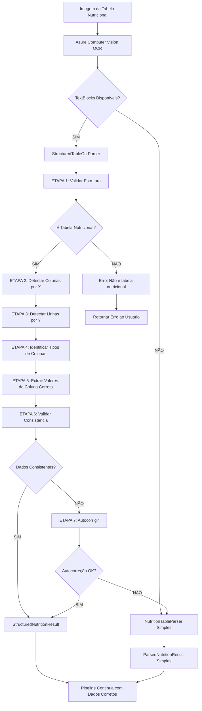
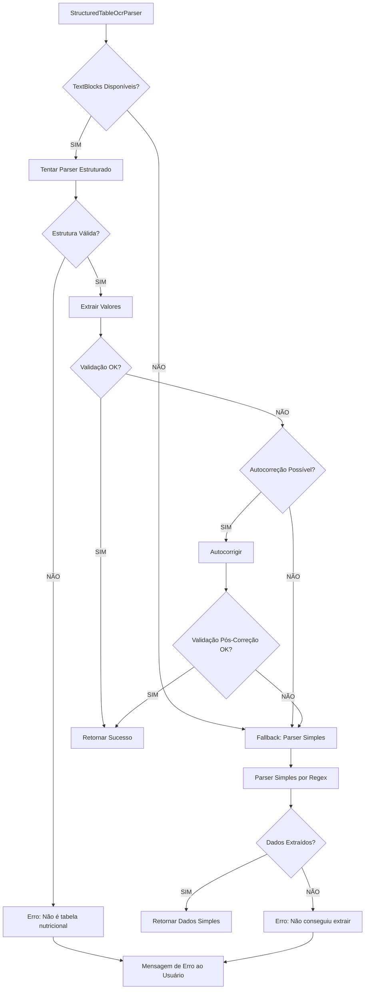

# 📊 Diagramas de Fluxo - Parser Estruturado OCR

## FLUXO PRINCIPAL



---

## DETALHAMENTO: CLUSTERING DE COLUNAS

```
┌─────────────────────────────────────────────────────────┐
│              TABELA NUTRICIONAL ORIGINAL               │
├───────────────┬─────────┬─────────┬─────────────────────┤
│ Nutriente     │ 100 ml  │  20 g   │  %VD                │
├───────────────┼─────────┼─────────┼─────────────────────┤
│ Carboidratos  │   12    │   15    │   5                 │
│ Proteínas     │   3.6   │   0.7   │   1                 │
└───────────────┴─────────┴─────────┴─────────────────────┘

OCR RETORNA:
TextBlock("Carboidratos", X=50,  Y=200, W=100, H=20)
TextBlock("12",          X=220, Y=200, W=30,  H=20) ← Coluna 0
TextBlock("15",          X=270, Y=200, W=30,  H=20) ← Coluna 1
TextBlock("5",           X=320, Y=200, W=20,  H=20) ← Coluna 2
TextBlock("Proteínas",   X=50,  Y=230, W=80,  H=20)
TextBlock("3.6",         X=220, Y=230, W=30,  H=20) ← Coluna 0
TextBlock("0.7",         X=270, Y=230, W=30,  H=20) ← Coluna 1
TextBlock("1",           X=320, Y=230, W=20,  H=20) ← Coluna 2

CLUSTERING POR X:
┌─────────────────────────────────────────────────────────┐
│ AGRUPAMENTO POR COORDENADA X (Tolerância ±15px)       │
├─────────────────────────────────────────────────────────┤
│ Coluna 0 (X ≈ 220px):  "12", "3.6"                     │
│ Coluna 1 (X ≈ 270px):  "15", "0.7"                     │
│ Coluna 2 (X ≈ 320px):  "5", "1"                        │
└─────────────────────────────────────────────────────────┘

IDENTIFICAÇÃO DE TIPOS:
┌─────────────────────────────────────────────────────────┐
│ Coluna 0 → Cabeçalho: "100 ml" → Per100Index = 0 ✅    │
│ Coluna 1 → Cabeçalho: "20 g"   → PortionIndex = 1      │
│ Coluna 2 → Cabeçalho: "%VD"    → VdIndex = 2           │
└─────────────────────────────────────────────────────────┘

EXTRAÇÃO CORRETA:
✅ Carboidratos: 12g   (Coluna 0, não 15 ou 5)
✅ Proteínas:    3.6g  (Coluna 0, não 0.7 ou 1)
```

---

## DETALHAMENTO: VALIDAÇÃO CRUZADA

```
┌──────────────────────────────────────────────────────┐
│           VALIDAÇÃO DE CONSISTÊNCIA                 │
└──────────────────────────────────────────────────────┘

DADOS EXTRAÍDOS:
- Calorias:       100 kcal
- Proteínas:      6g
- Carboidratos:   15g  ← SUSPEITO
- Gorduras:       2g

CÁLCULO DE CALORIAS ESPERADAS:
expectedCalories = (6g × 4) + (15g × 4) + (2g × 9)
                 = 24 + 60 + 18
                 = 102 kcal

DELTA = |100 - 102| / 100 = 0.02 = 2% ✅ OK (<30%)

──────────────────────────────────────────────────────

DADOS EXTRAÍDOS (ERRO OCR):
- Calorias:       100 kcal
- Proteínas:      6g
- Carboidratos:   50g  ← ERRO OCR (pegou valor errado)
- Gorduras:       2g

CÁLCULO DE CALORIAS ESPERADAS:
expectedCalories = (6g × 4) + (50g × 4) + (2g × 9)
                 = 24 + 200 + 18
                 = 242 kcal

DELTA = |100 - 242| / 100 = 1.42 = 142% ❌ ERRO (>30%)

AUTOCORREÇÃO:
inferredCarbs = (100 - 24 - 18) / 4 = 14.5g ✅

RESULTADO FINAL:
✅ Carboidratos corrigidos: 50g → 14.5g
```

---

## COMPARAÇÃO: ANTES vs DEPOIS

```
┌─────────────────────────────────────────────────────────────┐
│                   ANTES (Parser Simples)                   │
└─────────────────────────────────────────────────────────────┘

OCR RawText:
"Carboidratos (g)\n12\n15\n5\nProteínas (g)\n3.6\n0.7\n1"

Parser Simples:
1. Pegar PRIMEIRO número após "Carboidratos" = 12 ✅
2. Pegar PRIMEIRO número após "Proteínas"    = 3.6 ✅

PROBLEMA: Funciona apenas para tabelas padronizadas.
Se OCR fragmentar diferente, pega valores errados.

┌─────────────────────────────────────────────────────────────┐
│                   DEPOIS (Parser Estruturado)               │
└─────────────────────────────────────────────────────────────┘

OCR TextBlocks com coordenadas:
[
  { Text: "Carboidratos", X: 50,  Y: 200 },
  { Text: "12",          X: 220, Y: 200 },  ← MESMA LINHA (Y=200)
  { Text: "15",          X: 270, Y: 200 },  ← OUTRA COLUNA (X=270)
  { Text: "Proteínas",   X: 50,  Y: 230 },
  { Text: "3.6",         X: 220, Y: 230 }   ← MESMA COLUNA (X=220)
]

Parser Estruturado:
1. Agrupar por Y=200: ["Carboidratos", "12", "15"]
2. Filtrar por X=220 (coluna 100ml): "12" ✅
3. Agrupar por Y=230: ["Proteínas", "3.6"]
4. Filtrar por X=220 (coluna 100ml): "3.6" ✅

VANTAGEM: Funciona SEMPRE, independente de fragmentação.
Usa estrutura espacial real da tabela.
```

---

## FLUXO DE DECISÃO: FALLBACK



---

## EXEMPLO VISUAL: COORDENADAS ESPACIAIS

```
┌───────────────────────────────────────────────────────────┐
│ Y=100                                                     │
│ ┌───────────────────────────────────────────────┐         │
│ │  INFORMAÇÃO NUTRICIONAL                      │         │
│ └───────────────────────────────────────────────┘         │
│                                                           │
│ Y=150                                                     │
│ ┌──────────┬──────────┬──────────┬──────────┐            │
│ │Nutriente │ 100 ml   │  20 g    │  %VD     │            │
│ │(X=50)    │(X=220)   │(X=270)   │(X=320)   │            │
│ └──────────┴──────────┴──────────┴──────────┘            │
│                                                           │
│ Y=200                                                     │
│ ┌──────────┬──────────┬──────────┬──────────┐            │
│ │Carbs     │   12     │   15     │    5     │            │
│ │(X=50)    │(X=220)   │(X=270)   │(X=320)   │            │
│ └──────────┴──────────┴──────────┴──────────┘            │
│            ▲                                              │
│            │                                              │
│            └─ Valor correto (Coluna X=220)               │
│                                                           │
│ Y=230                                                     │
│ ┌──────────┬──────────┬──────────┬──────────┐            │
│ │Proteínas │   3.6    │   0.7    │    1     │            │
│ │(X=50)    │(X=220)   │(X=270)   │(X=320)   │            │
│ └──────────┴──────────┴──────────┴──────────┘            │
│            ▲                                              │
│            │                                              │
│            └─ Valor correto (Coluna X=220)               │
└───────────────────────────────────────────────────────────┘

CLUSTERING:
- Linhas (Y):  [200, 230] → 2 linhas de nutrientes
- Colunas (X): [50, 220, 270, 320] → 4 colunas

MAPEAMENTO:
- X=50  → Nome do nutriente
- X=220 → Valores por 100ml ✅ ALVO
- X=270 → Valores por porção (20g)
- X=320 → %VD (ignorar)

EXTRAÇÃO:
Para cada linha (Y=200, Y=230):
  1. Identificar nutriente (X=50)
  2. Pegar valor na coluna alvo (X=220)
  3. Ignorar outras colunas (X=270, X=320)
```

---

**📚 Esta documentação visual complementa o README principal para facilitar o entendimento da solução.**
